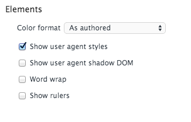
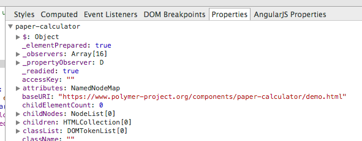
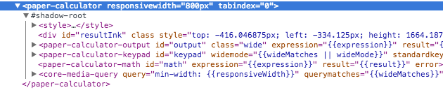
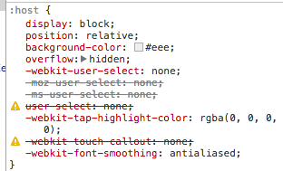
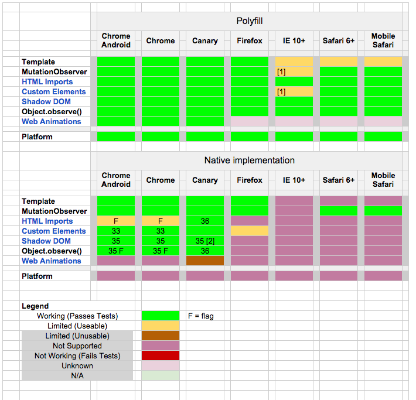

# Polymer

> Le web de demain, aujourd'hui

---

Wikipedia.org: Polymer
> du grec polus, plusieurs, et meros, partie

---

## Objectif:

Éléments HTML sur mesure et réutilisables

## Moyen:
Librairie( Web Components )

---

# Web Components ?

* Template natifs
* Object.observe / 2 way data-binding
* shadow dom
* custom element
* html import

---

# Concepts importants
## des Web Components

* Tout peut être un élément, visuel ou non
* css non invasif par défaut
* les évènements ne sont pas morts

---

# Polymer Vs Web components

* Polyfill
* lib de "simplification"

---

# Polymer Vs Angular.js

    Polymer = Directives( Angular.js) - Angular.js

---

# Éléments non visuels

appel ajax

    core-ajax(url="api.twitter.com", params='{"key":"val"}', method="GET", auto)

local-storage

    core-localstorage(name="code3" valeur="Égalitarisme")

carte google maps

    google-map(latitude="37.77493", longitude="-122.41942")

routeur de page

    app-router
      app-route(path="/tracks/add", import="add-track.html")
      app-route(path="/tracks/stats", import="stat-tracks.html")

back end complet

    code3-backend(api="https://api.code3.ca")

---

# Un aire d'élément
##(ou l'inverse)

    polymer-element(name="code3-aire-text", noscript,
                    attributes="longueur, largeur")
      template
        {{longueur * largeur}}

-

    code3-aire-text(longueur=10, largeur=12)

-

    <code3-aire-text longueur=10 largeur=12> 120 </code3-aire-text>

---

# Change d'aire

    polymer-element(name="code3-aire-valeur", noscript,
                    attributes="longueur, largeur, aire")
      script.
        Polymer({
          longueurChanged:function(){
            computeAire()
          },
          largeurChanged:function(){
            computeAire()
          },
          computeAire:function(){
            this.aire = this.largueur * this.longueur;
          }
        })

---

# Exemple d'appel ajax déclaratif

    polymer-element(name="code3-auto-save-form", noscript)
      template
        core-ajax(url="/api/run", method="POST", auto, params="{{ run }}")
        form
          core-field
            label Date
            core-input(value="{{run.date}}", type="date")
          core-field
            label Distance
            core-input(value="{{run.distance}}", type="number")

---

# T'as l'air différent

    polymer-element(name="code3-button", noscript, attributes="color, text")
      template
        style
          button {
            color: {{ color }};
        }
        button {{text}}

---

#  Expression !== Js
## mais...

    core-item(label="Add", class="{{(selected=='add-track')?'core-selected':'' }}")

---

#  Filtre
## à aire

    {{employe.salaire | CAD}}

-

    {{exp | filtre( arg )}} === filtre: (exp, arg )-> ...

---

# Ça à pas l'air vrai !

    polymer-element(name="code3-click-counter")
      template
        button(label="click me", on-click="{{inc}}")
        core-ajax#req(url="/api/counter", method="POST",
                      params="{{ {counter: counter} }}")
      script./* en coffee pour la conscision*/
        Polymer
          ready: ->
            this.$.req.addEventListener "core-response", ->
              console.log "YEAH !!! #{this.counter}"
          counter: 0
          inc: ->
            counter++
            this.$.req.go()

---

# Un aire *import* ant

    head
      link(rel="import", href="bower-components/code3-button/code3-button.html")

---

# Répétition / conditionnelle

    template(if="{{exp}}")
    template(repeat="{{exp in exps}}")

---

# Mes outils marchent encore ?

---

Options dev tools

---

Propriété d'éléments

---

Inspection d'élément

---

Inspection css

---

Ok ca marche dans chrome, mais les autres ?

http://www.polymer-project.org/resources/compatibility.html

---

# Alternatives à Polymer

* Api natives
* Mozilla *x-tag* [xtags.org](xtags.org)
* Bosonic [bosonic.github.com](bosonic.github.com)

---

# Ressources

* Liste de web components:
  * [webcomponents.org](http://webcomponents.org/)
  * [customelements.io](http://customelements.io/)
* Polymer: [polymer-project.org](http://polymer-project.org)
* html5rocks: [html5rocks.com](http://www.html5rocks.com/)

---

[benzen.github.io](https://benzen.github.io)

[benjamin.dreux@code3.ca](mailto:benjamin.dreux@code3.ca)

[@BenjaminDreux](https://twitter.com/BenjaminDreux)
